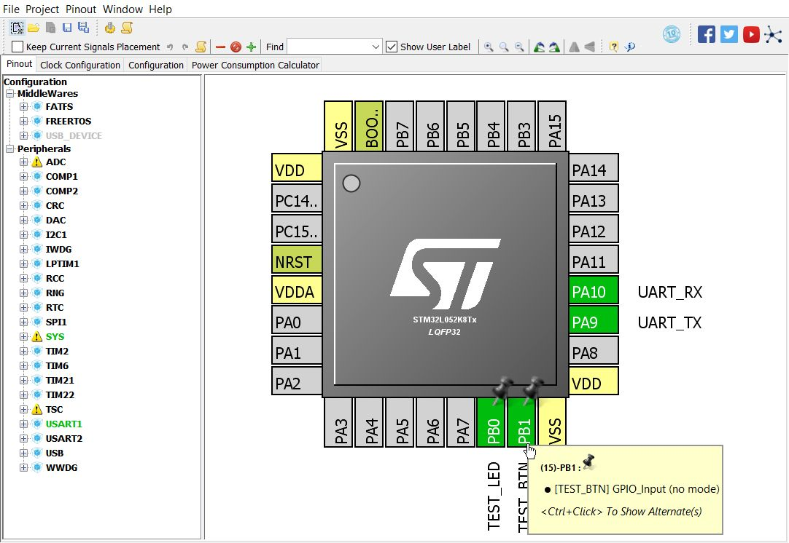
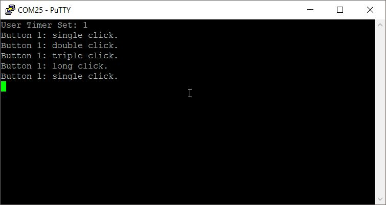

This program handles input events from the pushbutton(s).

Please visit [blog](https://innomatic.blogspot.ca) for more information.
Also note that this program requires files from [other respository](https://bitbucket.org/innomatica/utility).
